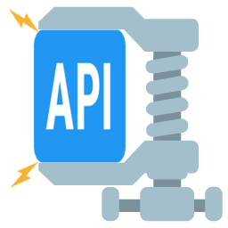

# Stressify

Basic http stressor tool focused on Rest Apis.

You just need 5 minutes to get valuable information related to your APIs timing.



# Getting Started

These instructions will get you a copy of the project up and running on your local machine for development and testing purposes.

# Prerequisites

What things you need to install the software and how to install them

```
java 1.7 or later
```

# Install

- Download **stressify.jar** from [here](https://github.com/utec/stressify/releases)


# Start

```
java -jar stressify.jar
```

# Usage

- File > New Project
- Select some method: get, post, put, delete, enter your url and headers like postman


- In the body tab, enter whatever you need but string
- In Assert Response Script tab, left empty or add something like this to ensure that exist a property in your json with **name** as key and **Duke** as value:

```
def status = jsonPath('$.name')
assertThat(status).isEqualTo('Duke')
```
- In settings you must select the report destination, report name and if you want charts:


- Finally enter the number of virtual users, select the stress mode(sequential/parallel) and press **Start Stress** button:


# Results

Every time you press the **Start Stress** button, you will have these files:


**csv** file will contain valuable data of the stress execution:


						

| field | description |
|-------|-------------|
| id    | unique id of each http request |
| startDate | start date of http request |
| endDate      | end date of http request |
| responseStatus      | status of http request |
| totalExecutionMillisTime  | how long did the http invocation take   |
| log      | message when an error is detected on each http invocation |

**log** file will contain the log of each request and or the errors. You can search here the id of some execution in the csv file

**png** file will contain a basic average chart (users vs response time). Red line is the real data and blue the average:


# Advanced usage

More complex settings and asserts are in the [wiki](https://github.com/utec/stressify/wiki)

## Versioning

1.0.0

## Contribute

More and more test and refactor code.

1.0.0

## Authors

* **Richard Leon Ingaruca** - *Initial work* - [JRichardsz](https://github.com/jrichardsz)


## License

This project is licensed under the Apache License V2 License - see the [LICENSE](LICENSE.md) file for details
